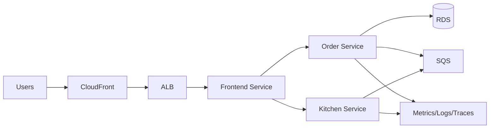
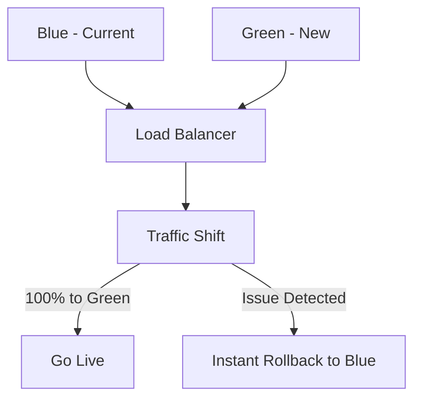
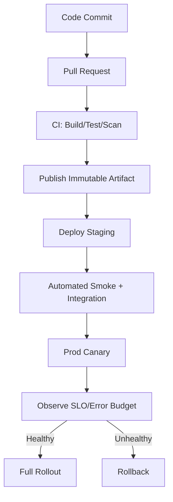

# DevOps, SRE, and AWS Master Handbook

## How to Use This Handbook

This handbook is designed as a complete, self-contained reference from beginner to advanced level.

Use this flow:
1. Read Chapters 1-3 for core foundations.
2. Read Chapter 4 for architecture patterns used in production.
3. Read Chapter 5 to implement a full enterprise project end-to-end.
4. Use appendices for command references, interview prep, and troubleshooting runbooks.

Conventions:
- "Concept" explains what it is.
- "Why" explains business and technical importance.
- "Where" explains practical usage.
- "Example" gives real-world context.
- "Interview Questions" gives realistic hiring questions with expected direction.
- "Commands / Code" gives practical snippets.
- "Troubleshooting" gives common failures and resolution.
- "Best Practices" and "Common Mistakes" summarize production lessons.

---

# Chapter 1: DevOps Fundamentals

## 1.1 SDLC (Software Development Life Cycle)

### Concept
SDLC is the structured process of planning, building, testing, releasing, operating, and improving software.

### Why It Is Needed
- Improves predictability and quality.
- Reduces release risk by adding checkpoints.
- Aligns engineering, security, product, and operations.

### Where It Is Used
- Product startups for rapid iteration.
- Enterprises with strict compliance (finance/healthcare).
- Platform teams standardizing delivery.

### Real-World Example
A fintech app uses a gated SDLC:
- Design review (security + architecture)
- PR checks
- Integration tests
- Pre-prod approval
- Progressive production deployment

### Interview Questions
1. What are the phases of SDLC, and where does DevOps improve the cycle?
2. How do you include security in SDLC without slowing delivery?
3. Difference between Agile SDLC and Waterfall SDLC in release management?

### Commands / Code
```bash
# Example release metadata tagging in git
git tag -a v1.7.0 -m "Release 1.7.0"
git push origin v1.7.0
```

### Troubleshooting
- Issue: Late defect discovery.
- Fix: Shift-left testing (unit + integration + SAST in PR).

### Best Practices
- Define entry/exit criteria for each phase.
- Use automated quality gates.
- Keep release notes machine-generated.

### Common Mistakes
- Treating testing as only QA responsibility.
- Missing rollback criteria in release phase.

---

## 1.2 CI/CD

### Concept
CI (Continuous Integration): frequently merge code with automated validation.
CD (Continuous Delivery/Deployment): automate release process to environments and optionally production.

### Why
- Reduces merge conflicts.
- Shortens time-to-market.
- Increases release confidence.

### Where
- Any team with multiple contributors.
- Required for microservice-heavy organizations.

### Real-World Example
An e-commerce platform runs CI per PR and CD for main branch with staged rollout:
- Build -> test -> scan -> artifact publish -> deploy to staging -> smoke test -> production canary.

### Interview Questions
1. Continuous Delivery vs Continuous Deployment?
2. How do you make pipelines idempotent and reliable?
3. Which quality gates are non-negotiable before production?

### Commands / YAML
```yaml
# .github/workflows/ci.yml
name: ci
on:
  pull_request:
  push:
    branches: [ main ]

jobs:
  build-test:
    runs-on: ubuntu-latest
    steps:
      - uses: actions/checkout@v4
      - uses: actions/setup-python@v5
        with:
          python-version: "3.12"
      - run: pip install -r requirements.txt
      - run: pytest -q
```

### Troubleshooting
- Pipeline flaky tests: isolate shared state, add retries only for external dependencies.
- Slow build: split jobs and cache dependencies.

### Best Practices
- Fast feedback under 10 minutes for PR checks.
- Immutable artifacts promoted across environments.
- Signed artifacts and provenance (SLSA-style controls).

### Common Mistakes
- Rebuilding artifact per environment.
- Manual environment drift outside pipeline.

---

## 1.3 Version Control (Git/GitHub)

### Concept
Distributed source control for code, history, collaboration, and rollback.

### Why
- Traceability, auditability, team collaboration.

### Where
- All software projects.

### Real-World Example
A platform team enforces branch protections:
- Mandatory reviews
- Required status checks
- Signed commits for critical repos

### Interview Questions
1. Rebase vs merge?
2. Git reset vs revert in shared branches?
3. How branch protection improves reliability?

### Commands
```bash
git checkout -b feature/order-idempotency
git add .
git commit -m "feat: add idempotency key validation"
git push -u origin feature/order-idempotency

git revert <commit_sha>
```

### Troubleshooting
- Detached HEAD confusion: checkout a branch then cherry-pick if needed.
- Force push mistakes: protect branches and require PRs.

### Best Practices
- Conventional commits.
- Small, reviewable PRs.
- Mandatory CODEOWNERS for critical paths.

### Common Mistakes
- Huge mixed PRs (refactor + feature + fixes).
- Rewriting history on shared branches.

---

## 1.4 Branching Strategies

### Options
1. Trunk-Based Development
2. GitFlow
3. Release Branching

### Recommendation
For high-velocity teams: trunk-based with feature flags.
For heavily regulated environments: release branches with strict approvals.

### Example Policy
- `main`: always releasable.
- short-lived feature branches (<2 days).
- release tags from `main`.

### Interview Questions
1. Why trunk-based improves deployment frequency?
2. When is GitFlow still useful?

### Common Mistakes
- Long-lived branches causing integration pain.

---

## 1.5 Jenkins and GitHub Actions

### Jenkins
- Strength: customization and plugin ecosystem.
- Use when: on-prem, custom enterprise controls.

### GitHub Actions
- Strength: tight GitHub integration, simple workflow-as-code.
- Use when: GitHub-hosted repos and cloud-native delivery.

### Jenkinsfile Example
```groovy
pipeline {
  agent any
  stages {
    stage('Build') { steps { sh 'docker build -t app:$BUILD_NUMBER .' } }
    stage('Test')  { steps { sh 'pytest -q' } }
    stage('Push')  { steps { sh 'docker push 123456789012.dkr.ecr.us-east-1.amazonaws.com/app:$BUILD_NUMBER' } }
  }
}
```

### Best Practices
- Pipeline as code in repo.
- Reusable templates.
- Secret manager integration (not plain env vars).

---

## 1.6 Build Tools

### Common Tools
- Java: Maven/Gradle
- Node: npm/pnpm/yarn
- Python: pip/poetry
- Go: native `go build`

### Example
```bash
mvn -B clean verify
npm ci && npm test
poetry install && poetry run pytest
```

### Best Practices
- Reproducible dependency lockfiles.
- Separate build and runtime container layers.

---

## 1.7 Artifact Management

### Concept
Store immutable versioned binaries/images in trusted registries.

### Tools
- JFrog Artifactory, Nexus
- AWS ECR for container images

### Best Practices
- Never deploy from source branch directly.
- Promote artifact, do not rebuild.
- Retention + lifecycle policy.

---

## 1.8 Infrastructure as Code (IaC)

### Concept
Define infrastructure declaratively in code with review and automation.

### Why
- Prevent configuration drift.
- Auditable and repeatable environments.

### Terraform Example
```hcl
provider "aws" { region = "us-east-1" }

resource "aws_s3_bucket" "logs" {
  bucket = "lumiere-prod-access-logs"
}
```

### Commands
```bash
terraform fmt -recursive
terraform init
terraform validate
terraform plan -out tfplan
terraform apply tfplan
```

### Troubleshooting
- State lock issues: use remote backend with DynamoDB lock.
- Drift: run periodic plan in read-only mode and alert on changes.

### Best Practices
- Separate state per environment.
- Use modules and version pinning.
- Policy as code (OPA/Sentinel).

---

## 1.9 Containers

### Concept
Package app + dependencies in a portable runtime image.

### Dockerfile Best Practice Example
```dockerfile
FROM python:3.12-slim AS base
WORKDIR /app
COPY requirements.txt .
RUN pip install --no-cache-dir -r requirements.txt
COPY . .
USER 10001
CMD ["python", "app.py"]
```

### Commands
```bash
docker build -t cafe-frontend:1.0.0 .
docker run -p 8080:8080 cafe-frontend:1.0.0
```

### Common Mistakes
- Running as root.
- Large images with unnecessary tools.

---

## 1.10 Kubernetes

### Concept
Container orchestration for scheduling, scaling, and self-healing.

### Core Objects
- Deployment
- Service
- Ingress
- ConfigMap/Secret
- HPA

### Example Deployment
```yaml
apiVersion: apps/v1
kind: Deployment
metadata:
  name: order-service
spec:
  replicas: 3
  selector:
    matchLabels:
      app: order-service
  template:
    metadata:
      labels:
        app: order-service
    spec:
      containers:
        - name: app
          image: 123456789012.dkr.ecr.us-east-1.amazonaws.com/order-service:1.0.0
          ports:
            - containerPort: 5000
          readinessProbe:
            httpGet:
              path: /health
              port: 5000
            initialDelaySeconds: 5
            periodSeconds: 10
```

### Commands
```bash
kubectl get pods -A
kubectl describe pod <pod>
kubectl logs -f deploy/order-service
kubectl rollout status deploy/order-service
kubectl rollout undo deploy/order-service
```

### Troubleshooting
- CrashLoopBackOff: inspect logs/events, verify env/config/secrets.
- NotReady: failing readiness probe; validate endpoint and startup time.

### Best Practices
- Resource requests/limits.
- Pod disruption budgets.
- Network policies and RBAC.

---

## 1.11 GitOps

### Concept
Git is source of truth for desired cluster state; controller reconciles automatically.

### Tools
- Argo CD / Flux

### Benefits
- Drift detection.
- Auditable deployments.
- Fast rollback by git revert.

### Example
```bash
# Roll back by reverting manifest commit
git revert <manifest_commit>
git push origin main
```

---

## 1.12 Monitoring

### Layers
- Infrastructure metrics (CPU, memory, disk)
- Application metrics (latency, throughput, errors)
- Business metrics (orders/min, payment success)

### Golden Signals
- Latency
- Traffic
- Errors
- Saturation

### Example Prometheus Alert
```yaml
groups:
  - name: api-alerts
    rules:
      - alert: High5xxRate
        expr: sum(rate(http_requests_total{status=~"5.."}[5m])) / sum(rate(http_requests_total[5m])) > 0.02
        for: 10m
        labels:
          severity: critical
        annotations:
          summary: "5xx error rate above 2%"
```

---

## 1.13 Security in DevOps (DevSecOps)

### Controls
- SAST, DAST, dependency scanning
- Container image scanning
- Secret scanning
- Least privilege IAM

### Pipeline Steps
1. Static code scan
2. Dependency vulnerability scan
3. IaC policy scan
4. Signed artifact publish

### Common Mistakes
- Hard-coded secrets.
- No patch windows for base images.

---

## 1.14 Release Strategies

### Types
- Recreate
- Rolling
- Blue/Green
- Canary
- Feature flags

### Recommendation Matrix
- Low risk + stateless: rolling
- High impact user-facing: canary + auto rollback
- Major schema change: blue/green with compatibility layer

---

# Chapter 2: SRE Complete Guide

## 2.1 SLI, SLO, SLA

### Definitions
- SLI: measured indicator (e.g., request success rate)
- SLO: target objective (e.g., 99.9% monthly availability)
- SLA: external contractual commitment

### Why
SLOs align reliability engineering work with business priorities.

### Example
- SLI: successful requests / total requests
- SLO: 99.95% over 30 days
- Error budget: 0.05%

### Formula
$$
Availability = \frac{Successful\ Requests}{Total\ Requests}
$$

### Interview Questions
1. Why should SLO be stricter than SLA internally?
2. How do you define user-centric SLIs?

---

## 2.2 Error Budgets

### Concept
Allowed unreliability within SLO window.

### Use
- If budget burns fast: freeze feature releases, prioritize reliability.
- If budget healthy: continue feature velocity.

### Example Burn Rate Alert
```yaml
- alert: FastBurnRate
  expr: (1 - (sum(rate(http_requests_total{status!~"5.."}[5m])) / sum(rate(http_requests_total[5m])))) / (1 - 0.999) > 14
  for: 5m
```

---

## 2.3 Incident Management

### Lifecycle
1. Detect
2. Triage
3. Contain
4. Mitigate
5. Resolve
6. Postmortem

### Roles
- Incident Commander
- Communications Lead
- Ops Lead
- Subject Matter Expert

### Real-World Pattern
Use severity matrix (SEV1-SEV4) and time-bound comms cadence.

### Common Mistakes
- No single incident commander.
- Poor timeline capture during outage.

---

## 2.4 Alerting Strategy

### Good Alerts
- Actionable
- Symptom-based first, cause-based second
- Severity-tagged with routing policies

### Anti-Patterns
- Alert storms without deduplication.
- CPU-only alerts without user impact correlation.

### Example Multi-window, Multi-burn
- Fast window catches acute failure.
- Slow window catches chronic degradation.

---

## 2.5 Observability

### Pillars
- Metrics
- Logs
- Traces

### Stack Example
- Prometheus + Alertmanager
- Loki/ELK
- Tempo/Jaeger
- Grafana dashboards

### Correlation
Propagate trace IDs across services and include in logs.

```python
# Python logging example with trace id
a_logger.info("payment attempt", extra={"trace_id": trace_id, "order_id": order_id})
```

---

## 2.6 Root Cause Analysis (RCA)

### Framework
- Timeline
- Trigger
- Contributing factors
- Blast radius
- Corrective/preventive actions

### Methods
- 5 Whys
- Fishbone diagram
- Fault tree

### Best Practices
- Blameless language.
- Focus on system weaknesses, not individual blame.

---

## 2.7 Postmortem Template

```markdown
# Incident Postmortem
Date:
Severity:
Duration:
Customer Impact:

## Summary

## Timeline (UTC)
- 10:02 Alert fired
- 10:08 Incident declared

## Root Cause

## What Went Well

## What Went Poorly

## Action Items
- [ ] Owner / ETA / Priority
```

---

## 2.8 Capacity Planning

### Inputs
- Historical peak traffic
- Growth projections
- Resource utilization percentiles (P50, P95, P99)
- Seasonal event assumptions

### Formula Example
$$
Required\ Capacity = Peak\ Demand \times Safety\ Factor
$$

### Best Practices
- Plan with headroom (20-40% depending on workload volatility).
- Validate with load tests and game days.

---

## 2.9 Availability and Reliability Engineering

### Principles
- Eliminate single points of failure.
- Design for graceful degradation.
- Automate failover.

### Tactics
- Retry with jittered backoff.
- Circuit breakers.
- Bulkheads and queue buffering.

---

## 2.10 Disaster Recovery (DR)

### Key Metrics
- RTO: max acceptable recovery time
- RPO: max acceptable data loss window

### DR Patterns
- Backup/restore
- Pilot light
- Warm standby
- Active-active

### AWS Mapping
- Snapshots + cross-region replication
- Multi-region data stores
- Route 53 health-check-based failover

---

## 2.11 High Availability Design

### Patterns
- Multi-AZ for database and compute
- Stateless services behind load balancers
- Queue-based decoupling

### Common Mistakes
- Multi-AZ app with single-AZ datastore.
- Un-tested failover runbooks.

---

# Chapter 3: AWS Complete Guide

## 3.1 IAM

### Concept
Identity and access management with users, roles, policies.

### Best Practices
- Least privilege.
- Role assumption instead of long-lived keys.
- MFA for human users.

### Example Policy
```json
{
  "Version": "2012-10-17",
  "Statement": [
    {
      "Effect": "Allow",
      "Action": ["s3:GetObject"],
      "Resource": ["arn:aws:s3:::my-bucket/*"]
    }
  ]
}
```

---

## 3.2 VPC

### Components
- CIDR blocks
- Public/private subnets
- Route tables
- NAT gateway
- Internet gateway
- NACL and Security Groups

### Secure Baseline
- Private subnets for apps/data.
- Public only for ingress layer (ALB/bastion if needed).

---

## 3.3 EC2

### Use Cases
- Legacy apps
- Stateful workloads
- Specialized kernels/drivers

### Commands
```bash
aws ec2 describe-instances --filters Name=instance-state-name,Values=running
```

---

## 3.4 S3

### Use Cases
- Static assets
- Backups/log archives
- Data lake

### Best Practices
- Block public access by default.
- Versioning + lifecycle + encryption.

### Commands
```bash
aws s3api put-bucket-versioning --bucket my-bucket --versioning-configuration Status=Enabled
```

---

## 3.5 EBS

### Notes
- Persistent block storage for EC2.
- Choose gp3/io2 depending on IOPS/latency needs.

---

## 3.6 ELB / ALB / NLB

### ALB
Layer 7 HTTP/HTTPS routing (path/host based).

### NLB
Layer 4 TCP/UDP with high performance and static IP support.

### Use
- ALB for web apps and microservices.
- NLB for low-latency TCP and gRPC pass-through scenarios.

---

## 3.7 Auto Scaling

### Types
- Target tracking
- Step scaling
- Scheduled scaling

### Example
Scale service to keep CPU ~60% and minimum 3 instances.

---

## 3.8 Route 53

### Features
- DNS management
- Health checks
- Failover and latency routing

### DR Use
Primary/secondary region failover with health checks.

---

## 3.9 RDS

### Best Practices
- Multi-AZ for production.
- Read replicas for read-heavy workloads.
- Automated backups and PITR.

---

## 3.10 DynamoDB

### Strengths
- Millisecond latency at scale.
- Serverless scaling.

### Design
- Model access patterns first.
- Use partition key carefully to avoid hot partitions.

---

## 3.11 EKS

### Use Cases
- Kubernetes standardization on AWS.
- Multi-team platform with shared cluster governance.

### Best Practices
- Managed node groups or Karpenter.
- IRSA for pod IAM.
- Cluster autoscaler and HPA.

---

## 3.12 ECS

### Use Cases
- Simpler container orchestration than Kubernetes.
- Fargate for no-node-management operations.

---

## 3.13 Lambda

### Use Cases
- Event-driven processing
- APIs with API Gateway
- Glue code across AWS services

### Common Pitfalls
- Cold starts for latency-sensitive paths.
- Large package sizes.

---

## 3.14 SNS / SQS

### Patterns
- SNS fanout to multiple subscribers.
- SQS for decoupled async processing.
- Use DLQ for poison messages.

---

## 3.15 CloudWatch

### Features
- Metrics, logs, alarms, dashboards
- Container insights

### Best Practices
- Standard log structure and retention.
- Alarm severities aligned to incident policy.

---

## 3.16 CloudTrail

### Purpose
Audit trail for API calls and account activities.

### Best Practices
- Enable organization-wide trails.
- Send logs to immutable storage and SIEM.

---

## 3.17 AWS Security Services

### Core Services
- AWS KMS
- AWS Secrets Manager
- AWS WAF
- AWS Shield
- Amazon GuardDuty
- AWS Security Hub
- Amazon Macie

### Enterprise Pattern
Security Hub as central findings aggregator across accounts.

---

## 3.18 Terraform on AWS

### Enterprise Structure
- `environments/prod`
- `modules/network`
- `modules/eks`
- `modules/rds`

### Remote State
- S3 backend
- DynamoDB lock table

```hcl
terraform {
  backend "s3" {
    bucket         = "org-terraform-state"
    key            = "prod/network/terraform.tfstate"
    region         = "us-east-1"
    dynamodb_table = "org-terraform-locks"
    encrypt        = true
  }
}
```

---

## 3.19 Multi-Account Strategy

### Recommended Accounts
- Management
- Shared services
- Security
- Log archive
- Dev/Test/Stage/Prod workload accounts

### Why
- Blast radius isolation
- Billing and policy boundaries
- Clear ownership model

---

## 3.20 Landing Zones

### Concept
Predefined secure baseline for multi-account AWS adoption.

### Components
- Guardrails (SCP)
- Identity federation
- Centralized logging
- Network baseline

### Tools
- AWS Control Tower
- Custom Terraform landing zone framework

---

# Chapter 4: Production Architecture Patterns

## 4.1 Microservices Pattern

### Architecture


### Best Practices
- Domain-driven boundaries.
- Contract testing.
- Asynchronous workflows for non-critical paths.

### Common Mistakes
- Shared database across all services.
- Distributed monolith with synchronous tight coupling.

---

## 4.2 Blue-Green Deployment

### Workflow


### When to Use
- Zero downtime requirement.
- High confidence rollback needed.

---

## 4.3 Canary Deployment

### Pattern
- 5% traffic -> observe
- 25% traffic -> observe
- 50% traffic -> observe
- 100% traffic

### Automated Gate
Rollback if:
- error rate > threshold
- p95 latency > threshold

---

## 4.4 Multi-Region DR

### Pattern
Primary region active, secondary warm standby.

### Design Notes
- Data replication (async/sync depending RPO)
- DNS failover orchestration
- Regional runbooks and game day validation

---

## 4.5 Zero Downtime Upgrades

### Techniques
- Backward-compatible schema migrations
- Feature flags for risky features
- Rolling/canary rollout with health checks

### DB Migration Rule
- Expand -> migrate -> contract pattern.

---

## 4.6 Secure Networking

### Principles
- Least privilege network access.
- East-west and north-south segmentation.
- Private endpoints for internal service access.

### AWS Controls
- Security groups per tier
- NACL for coarse controls
- AWS WAF + Shield for edge protection

---

# Chapter 5: Real-World Enterprise Project Implementation

## 5.1 Project: Cafe Lumiere Enterprise Platform

### Scope
Build an enterprise-grade restaurant ordering platform with:
- Frontend service
- Order service
- Kitchen service
- PostgreSQL
- Message queue for async kitchen workflow
- EKS deployment on AWS
- Full CI/CD, observability, and DR controls

## 5.2 Repository Structure

```text
repo/
  frontend/
  order-service/
  kitchen-service/
  infra/
    terraform/
      modules/
      environments/
  k8s/
    base/
    overlays/
  .github/workflows/
  Jenkinsfile
  docs/
```

## 5.3 Jenkins Pipeline (Enterprise)

```groovy
pipeline {
  agent any
  environment {
    AWS_REGION = 'us-east-1'
    ECR_REPO   = 'cafe-lumiere'
  }
  stages {
    stage('Checkout') { steps { checkout scm } }
    stage('Unit Tests') { steps { sh 'pytest -q' } }
    stage('Security Scan') { steps { sh 'trivy fs --exit-code 1 --severity HIGH,CRITICAL .' } }
    stage('Build Image') { steps { sh 'docker build -t $ECR_REPO:$BUILD_NUMBER .' } }
    stage('Push Image') {
      steps {
        sh 'aws ecr get-login-password --region $AWS_REGION | docker login --username AWS --password-stdin 123456789012.dkr.ecr.$AWS_REGION.amazonaws.com'
        sh 'docker tag $ECR_REPO:$BUILD_NUMBER 123456789012.dkr.ecr.$AWS_REGION.amazonaws.com/$ECR_REPO:$BUILD_NUMBER'
        sh 'docker push 123456789012.dkr.ecr.$AWS_REGION.amazonaws.com/$ECR_REPO:$BUILD_NUMBER'
      }
    }
    stage('Deploy Staging') { steps { sh 'helm upgrade --install cafe ./helm --namespace staging --create-namespace' } }
    stage('Smoke Test') { steps { sh 'curl -f https://staging.cafe.example.com/health' } }
    stage('Deploy Prod Canary') { steps { sh './scripts/canary_deploy.sh' } }
  }
  post {
    failure {
      sh './scripts/rollback.sh'
    }
  }
}
```

## 5.4 GitHub Actions Alternative Pipeline

```yaml
name: deploy
on:
  push:
    branches: [ main ]

jobs:
  release:
    runs-on: ubuntu-latest
    steps:
      - uses: actions/checkout@v4
      - run: docker build -t app:${{ github.sha }} .
      - run: echo "Run scans, push image, deploy via Argo CD"
```

## 5.5 Docker Standards

### Requirements
- Distroless/slim base images
- Non-root user
- Read-only filesystem where possible
- Image scanning in CI

## 5.6 Kubernetes Deployment (EKS)

```yaml
apiVersion: apps/v1
kind: Deployment
metadata:
  name: frontend
  namespace: prod
spec:
  replicas: 4
  selector:
    matchLabels:
      app: frontend
  template:
    metadata:
      labels:
        app: frontend
    spec:
      containers:
        - name: frontend
          image: 123456789012.dkr.ecr.us-east-1.amazonaws.com/frontend:1.0.0
          resources:
            requests:
              cpu: "200m"
              memory: "256Mi"
            limits:
              cpu: "1"
              memory: "512Mi"
          livenessProbe:
            httpGet:
              path: /health
              port: 8080
            initialDelaySeconds: 15
          readinessProbe:
            httpGet:
              path: /ready
              port: 8080
            initialDelaySeconds: 5
```

## 5.7 AWS Infrastructure (Terraform)

```hcl
module "vpc" {
  source = "../../modules/vpc"
  name   = "cafe-prod"
  cidr   = "10.20.0.0/16"
}

module "eks" {
  source          = "../../modules/eks"
  cluster_name    = "cafe-prod-eks"
  vpc_id          = module.vpc.vpc_id
  private_subnets = module.vpc.private_subnets
}

module "rds" {
  source              = "../../modules/rds"
  identifier          = "cafe-prod-db"
  engine              = "postgres"
  multi_az            = true
  backup_retention    = 14
  deletion_protection = true
}
```

## 5.8 Monitoring and Alerting

### Metrics
- API latency (p50/p95/p99)
- 4xx/5xx error rates
- Queue lag
- Pod restarts
- DB CPU/IO/connections

### Alerts
- Critical: availability and error budget burn
- Warning: saturation trend and queue depth

### Grafana Dashboard Sections
- Service health
- Customer impact
- Dependencies (DB/queue)
- Deployment markers

## 5.9 Rollback Strategy

### App Rollback
- Kubernetes rollout undo
- GitOps commit revert
- Route traffic back in blue/green

### Data Rollback
- Backward-compatible migrations
- PITR for severe data corruption scenarios

## 5.10 DR Plan

### Objectives
- RTO: 30 minutes
- RPO: 5 minutes

### Mechanisms
- Cross-region DB replica
- S3 cross-region replication
- ECR image replication
- IaC to recreate infra in secondary region

### DR Runbook
1. Declare disaster and severity.
2. Freeze deployments.
3. Promote secondary database.
4. Shift DNS with Route 53 failover policy.
5. Scale secondary region workloads.
6. Validate smoke tests and business metrics.
7. Communicate status every 15 minutes.

---

# Chapter 6: Troubleshooting Scenarios (Interview + Production)

## Scenario 1: Sudden 5xx Spike After Deployment

### Approach
1. Compare deployment marker with error spike.
2. Inspect canary vs baseline metrics.
3. Check pod logs and upstream dependency health.
4. Roll back if SLO burn rate exceeds threshold.

### Commands
```bash
kubectl rollout history deploy/order-service -n prod
kubectl logs -n prod deploy/order-service --tail=200
kubectl rollout undo deploy/order-service -n prod
```

## Scenario 2: Kubernetes Pods Pending

### Typical Causes
- Insufficient node resources
- Node selector/taint mismatch
- PVC binding issues

### Commands
```bash
kubectl describe pod <pod> -n prod
kubectl get events -n prod --sort-by=.lastTimestamp
kubectl get nodes
```

## Scenario 3: RDS Connection Saturation

### Fixes
- Add connection pooling (PgBouncer).
- Tune max connections and app pool settings.
- Investigate long-running queries and indexes.

## Scenario 4: Terraform Drift in Production

### Resolution
- Detect using scheduled `terraform plan`.
- Reconcile unauthorized manual changes.
- Enforce change policy with IAM and SCP.

---

# Chapter 7: Interview Master Pack (DevOps + SRE + AWS)

## 7.1 Core Questions
1. Explain end-to-end CI/CD for a microservice from commit to production.
2. How do you define SLOs for an API consumed by mobile and web clients?
3. Design a multi-account AWS setup for a regulated enterprise.
4. How would you reduce MTTR from 60 minutes to 15 minutes?
5. Compare EKS and ECS for enterprise platform workloads.

## 7.2 Advanced Scenario Questions
1. A canary rollout increases p95 latency but error rate is stable. What do you do?
2. During region outage, what is your exact DR failover process and rollback plan?
3. How do you secure secrets from laptop to runtime in Kubernetes?
4. How do you prevent noisy alerts while preserving incident detection quality?

## 7.3 Strong Answer Framework
- State assumptions.
- Present architecture and tradeoffs.
- Mention failure handling and observability.
- Include security and compliance controls.
- End with measurable outcomes (SLO, MTTR, deployment frequency).

---

# Chapter 8: Production Best Practices Checklist

## Engineering
- Standardize service templates.
- Enforce code reviews and quality gates.
- Keep services stateless where possible.

## Reliability
- SLO-based operations.
- Incident command model.
- Quarterly game days.

## Security
- Zero trust principles.
- Centralized secrets management.
- Runtime and supply-chain scanning.

## Cloud Governance
- Multi-account strategy.
- Cost and tagging policies.
- Preventive and detective guardrails.

## Data and DR
- Tested backups and restore drills.
- Defined RTO/RPO per critical service.
- Regional failover rehearsals.

---

# Appendix A: Essential Commands Reference

```bash
# Git
git fetch --all --prune
git rebase origin/main
git cherry-pick <sha>

# Docker
docker build -t app:local .
docker run --rm -p 8080:8080 app:local

# Kubernetes
kubectl get all -n prod
kubectl top pods -n prod
kubectl get hpa -n prod

# Terraform
terraform fmt -recursive
terraform validate
terraform plan
terraform apply

# AWS
aws sts get-caller-identity
aws eks update-kubeconfig --name cafe-prod-eks --region us-east-1
aws logs tail /aws/eks/cafe-prod-eks/cluster --follow
```

---

# Appendix B: Enterprise Delivery Workflow



---

# Appendix C: Common Mistakes Across DevOps/SRE/AWS

1. Treating monitoring as dashboard-only and ignoring alert quality.
2. Setting unrealistic SLOs without customer impact understanding.
3. Running production changes outside IaC.
4. Ignoring rollback paths during release planning.
5. Overprovisioning cloud resources with no cost governance.
6. Not validating restore from backups.
7. Keeping long-lived IAM credentials.
8. Shipping services without readiness/liveness probes.

---

# Final Notes

A high-performing DevOps + SRE + AWS organization is defined by:
- Fast and safe delivery
- Reliability goals tied to business outcomes
- Security integrated into every stage
- Continuous learning through incidents and improvements

Use this handbook as both an implementation blueprint and an interview preparation master reference.