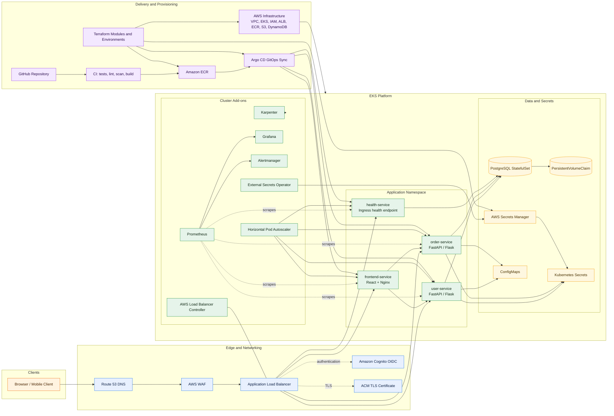

# Cafe Lumiere Production EKS Architecture

This blueprint deploys Cafe Lumiere as a production-ready microservices platform on AWS EKS. The diagram below shows the request path, platform layers, delivery pipeline, and supporting services.

## What This Blueprint Includes

- Public entry through Route 53, AWS WAF, and an ALB with ACM-backed TLS.
- Cognito-based authentication at the load balancer layer.
- EKS application workloads for the frontend, user API, order API, and health endpoint.
- PostgreSQL persistence through a StatefulSet and PVC-backed storage.
- Kubernetes secrets synced from AWS Secrets Manager by External Secrets Operator.
- Prometheus, Grafana, and Alertmanager for metrics, dashboards, and alerting.
- HPA for pod scaling and Karpenter for node provisioning.
- Terraform for AWS foundation and Argo CD for GitOps-based deployment promotion.

## Related Docs

- [Request flow](REQUEST_FLOW.md)
- [Deployment lifecycle](DEPLOYMENT_LIFECYCLE.md)
- [Operations runbook](OPERATIONS_RUNBOOK.md)
